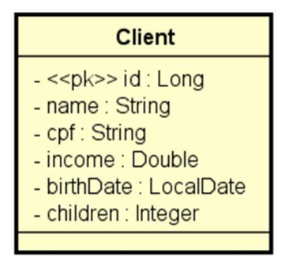

# DESAFIO - CRUD de Clientes


## Descrição

Desafio de projeto feito em Java e Spring Boot contendo um CRUD completo dos dados de cliente.

- Busca paginada
- Busca por ID
- Inserção
- Atualização
- Exclusão

O projeto deve ser executado em um ambiente de testes configurado para se conectar ao banco de dados H2, utilizando Maven como gerenciador de dependências.

## Instalação

### Requisitos

- [Java JDK 17+ instalado](https://www.oracle.com/br/java/technologies/downloads/)

### Passos

Clone o repositório na sua máquina

```
git clone https://github.com/douglaslima-pro/devsuperior-desafio-crud
```

Importe o projeto na sua IDE de preferência

Execute o projeto a partir da classe **Application**

Teste os endpoints usando um cliente HTTP como o **PostMan** ou acesse o cliente WEB do Swagger por meio do path `/swagger-ui/index.html`

## Cliente

Um cliente possui `nome`, `CPF`, `renda`, `data de nascimento`, e `quantidade de filhos`.



## Endpoints

### GET - /clients/{id}

Busca um cliente pelo ID.

#### Solicitação

```
Método: GET
URI: /clients/1
```

#### Resposta (200)

```json
{
    "id": 1,
    "name": "Ana Souza",
    "cpf": "123.456.789-01",
    "income": 5000.0,
    "birthDate": "1980-05-15",
    "children": 2
}
```

### GET - /clients

Busca de forma paginada todos os clientes.

#### Solicitação

```
Método: GET
URI: /clients?size=5&page=0&sort=income,desc
```

#### Resposta (200)

```json
{
    "totalElements": 10,
    "totalPages": 2,
    "size": 5,
    "content": [
        {
            "id": 7,
            "name": "Sandra Oliveira",
            "cpf": "789.012.345-67",
            "income": 8000.0,
            "birthDate": "1978-09-25",
            "children": 4
        },
        {
            "id": 3,
            "name": "Fernanda Lima",
            "cpf": "345.678.901-23",
            "income": 7000.75,
            "birthDate": "1975-03-10",
            "children": 3
        },
        {
            "id": 6,
            "name": "Roberto Santos",
            "cpf": "678.901.234-56",
            "income": 6000.3,
            "birthDate": "1983-04-17",
            "children": 1
        },
        {
            "id": 5,
            "name": "Mariana Costa",
            "cpf": "567.890.123-45",
            "income": 5500.2,
            "birthDate": "1995-11-04",
            "children": 2
        },
        {
            "id": 1,
            "name": "Ana Souza",
            "cpf": "123.456.789-01",
            "income": 5000.0,
            "birthDate": "1980-05-15",
            "children": 2
        }
    ],
    "number": 0,
    "sort": {
        "empty": false,
        "unsorted": false,
        "sorted": true
    },
    "pageable": {
        "pageNumber": 0,
        "pageSize": 5,
        "sort": {
            "empty": false,
            "unsorted": false,
            "sorted": true
        },
        "offset": 0,
        "unpaged": false,
        "paged": true
    },
    "first": true,
    "last": false,
    "numberOfElements": 5,
    "empty": false
}
```

### POST - /clients

Insere um novo cliente.

#### Solicitação

```
Método: POST
URI: /clients
Corpo:
{
    "name": "Douglas Lima",
    "cpf": "012.345.678-90",
    "income": 1558.0,
    "birthDate": "2003-01-11",
    "children": 0
}
```

#### Resposta (201)

```json
{
    "id": 11,
    "name": "Douglas Lima",
    "cpf": "012.345.678-90",
    "income": 1558.0,
    "birthDate": "2003-01-11",
    "children": 0
}
```

### PUT - /clients

Atualiza um cliente pelo ID.

#### Solicitação

```
Método: PUT
URI: /clients
Corpo:
{
    "name": "Douglas",
    "cpf": "012.345.678-90",
    "income": 2000.0,
    "birthDate": "2003-01-11",
    "children": 0
}
```

#### Resposta (200)

```json
{
    "id": 11,
    "name": "Douglas",
    "cpf": "012.345.678-90",
    "income": 2000.0,
    "birthDate": "2003-01-11",
    "children": 0
}
```

### DELETE - /clients/{id}

Deleta um cliente pelo ID.

#### Solicitação

```
Método: DELETE
URI: /clients/11
```

#### Resposta (204)

```

```
